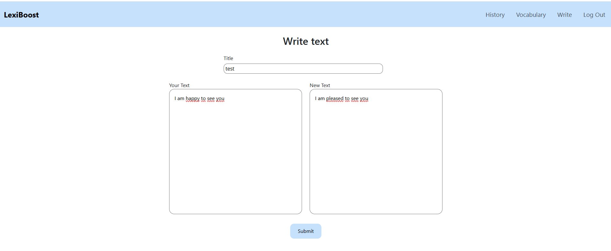

# LexiBoost

## Live demo: https://project-lexiboost.onrender.com
## Video demo: https://youtu.be/8ymwa4XrSKU
## Screenshot



## Versions

| Date       | Version | Description          |
|------------| ------- |----------------------|
| 12/12/2025 | 1.0.0   | Initial CS50 version |
| 19/06/2026 | 2.0.0   | Application refactored using Flask Blueprints, SQLAlchemy and Service Layer          |


## Description
LexiBoost is a web application that helps English learners improve their vocabulary by encouraging them to use words they have already learned.
Unlike grammar correction tools or AI writing assistants, LexiBoost focuses on vocabulary practice. Its purpose is simple: detect common words in a text and replace them with synonyms that already exist in the user's personal vocabulary list.
As an English learner myself, I noticed that I often used the same basic words even after learning more advanced vocabulary. This project was created to solve that problem by making vocabulary practice part of the writing process.

When a user submits a text, LexiBoost:
1. Splits the text into individual words.
2. Retrieves possible synonyms using the Datamuse API.
3. Compares those synonyms with the user's saved vocabulary.
4. Replaces words whenever a learned synonym is found.
5. Stores both the original and modified text in the user's history.
The application is intentionally simple. It is designed as a vocabulary learning tool rather than an AI-powered writing assistant..

## Features
- User authentication
- Personal vocabulary list
- Vocabulary replacement while writing
- Writing history
- User-specific data
- Responsive interface
- Password hashing
- Session management
- Database persistence

## Technologies
LexiBoost was built using:
- **Python**: Backend programming language.
- **Flask**: Web framework.
- **Flask Blueprints**: Modular route organization.
- **MySQL**: Relational database.
- **SQLAlchemy**: ORM used to map Python classes to database tables and simplify database operations.
- **Flask-Session**: Server-side session management.
- **HTML, CSS, JavaScript, Jinja2**
- **Datamuse API**: Used to find words that are similar in meaning.
- **Pytest**: Unit testing framework.

## Setup (run locally)
```bash
# Clone the repo
git clone https://github.com/AlbaCabal/lexiboost.git
cd lexiboost

# Create a virtual environment
python -m venv venv
source venv/bin/activate   # Windows: venv\Scripts\activate

# Install dependencies
pip install -r requirements.txt

# Create database with schema.sql

# Set environment variables (create a .env file)
USER_BD=name-user
PASS_BD=password-user
HOST_BD=host:port
NAME_BD=name-db
SECRET_KEY=your-secret-key


# Run the app
flask run
```
Run the test suite with:
```bash
pytest
```

## Project Structure
The project follows a modular architecture inspired by the MVC pattern, using Flask's **Application Factory** pattern so the app can be configured and tested independently of a single global instance.

- `app/`
  - `__init__.py`
  - `extensions.py`
  - `models.py`
  - `routes/`
    - `auth_routes.py`
    - `content_routes.py`
  - `services/`
    - `history_service.py`
    - `user_service.py`
    - `vocabulary_service.py`
  - `static/`
    - `css/`
      - `layout.css`
      - `styles.css`
    - `js/`
      - `main.js`
  - `templates/`
    - `users/`
      - `index.html`
      - `vocabulary.html`
      - `write.html`
    - `layout.html`
    - `login.html`
    - `register.html`
- `tests/`
  - `conftest.py`
  - `test_models.py`
  - `test_user_service.py`
  - `test_vocabulary.py`
- `requirements.txt`
- `pytest.ini`

**Routes** are split into Blueprints by responsibility (auth vs. content), keeping each file small and focused.

**Services** hold the business logic separately from the HTTP layer — `vocabulary_service.py` handles adding/retrieving/deleting vocabulary and duplicate checks, `history_service.py` stores and retrieves writing history, `user_service.py` handles user operations. This keeps routes thin and makes the logic unit-testable without spinning up a Flask request context.

## Design Decisions
* **Service Layer**: business logic was moved out of routes into dedicated service classes, making it reusable and testable in isolation.
* **Flask Blueprints**: routes were split by functionality instead of one large file.
* **SQLAlchemy**: reduced raw SQL and made schema changes easier to manage.
* **User-specific vocabulary**: each user maintains an independent list, enabling personalized learning.
* **Writing history**: every submitted text is saved so learners can track vocabulary progress over time.

## What I learned
Migrating from a single-file CS50 script to a Blueprint + Service Layer + SQLAlchemy structure was the main challenge of v2.0.0. The biggest lesson was around **dependency resolution in production**: a naming collision between two similarly-named PyPI packages (`datamuse` vs `python-datamuse`) caused a `500` error on Render that didn't reproduce locally, since both were installed in my local environment but only one was pinned correctly in `requirements.txt`. It reinforced the importance of testing installs in a clean virtual environment before deploying.

## Future Improvements
- **Predefined vocabulary by level**: Add built-in vocabulary lists for common English levels such as B1, B2, C1, and C2, so users can start practicing without manually adding every word.
- **Grammar and spelling correction**: Extend the application to detect and correct basic grammar and spelling mistakes, making it a more complete writing support tool.
- **Visual highlight for changed words**: Show replaced words with a green underline, so users can easily see what was modified in their text.
- **Word meaning on hover**: Display the meaning of a replaced word when the user moves the mouse over it, helping learners understand and remember new vocabulary.
